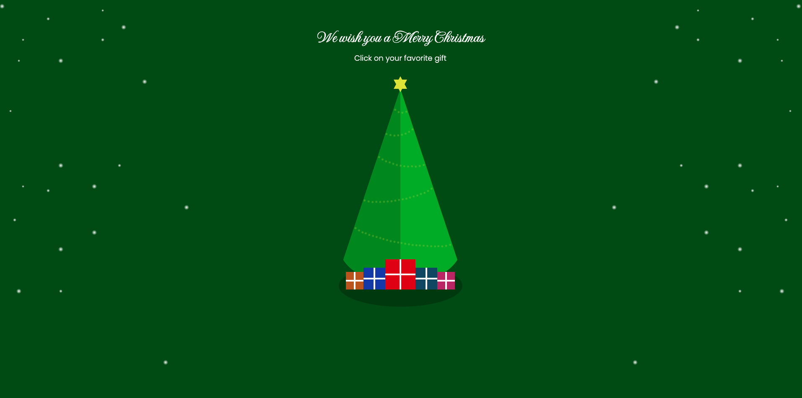

# Christmas Tree | HTML, CSS & JavaScript

✅ Projeto concluído

<a href="#description">Description</a> •
<a href="#technologies">Technologies</a> •
<a href="#functionalities">Functionalities</a>

## Description

Christmas tree made entirely with HTML, CSS and JavaScript.

## Technologies

📍 HTML  
📍 CSS  
📍 JavaScript

## Functionalities

<strong>Single page application with the following features:</strong>

📍 Gift-shaped buttons that play different Christmas songs.

[To see more about how the application works, visit:](https://youtu.be/xx36PH4ZL3E)
